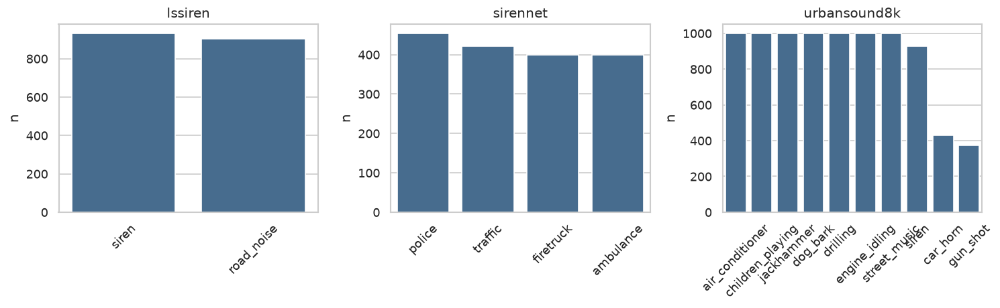
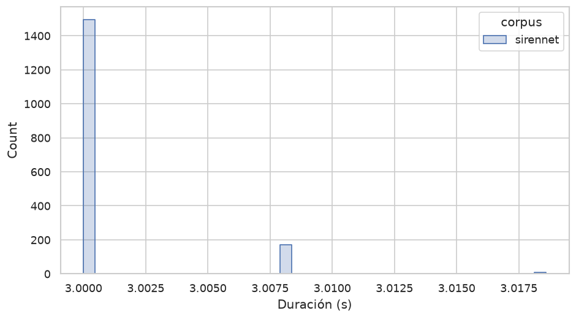
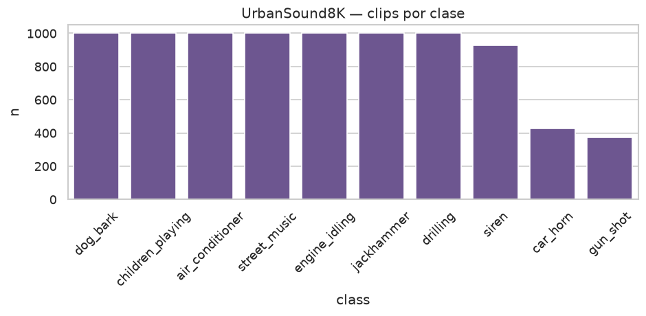
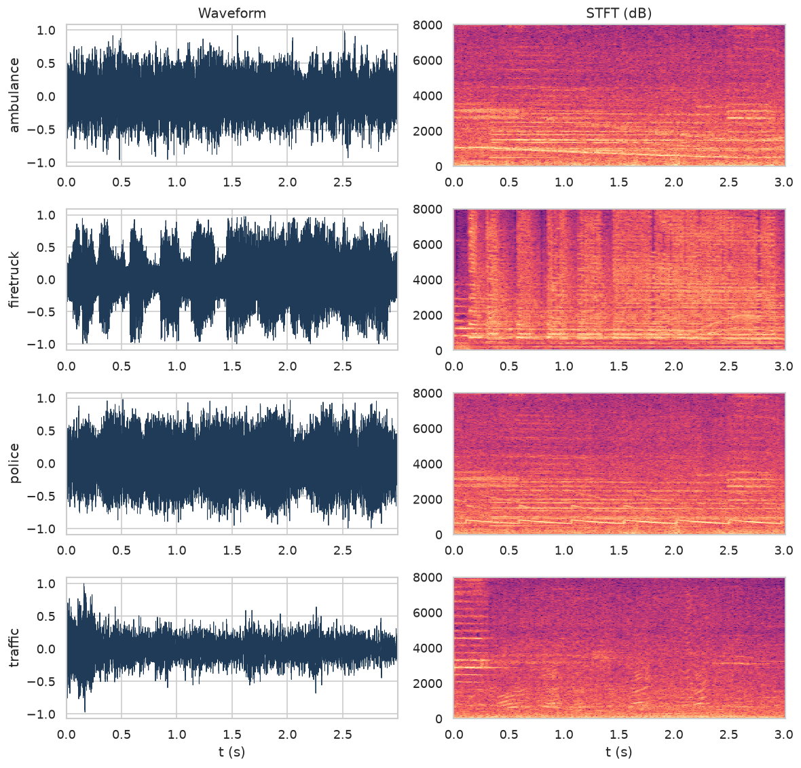
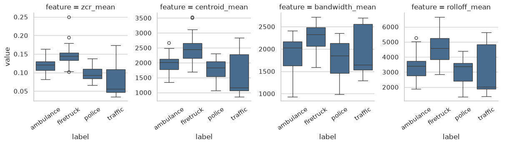
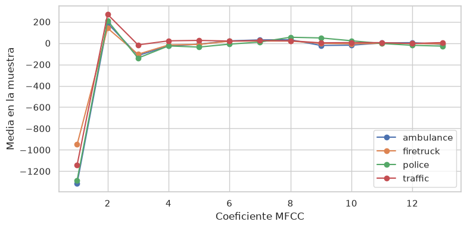
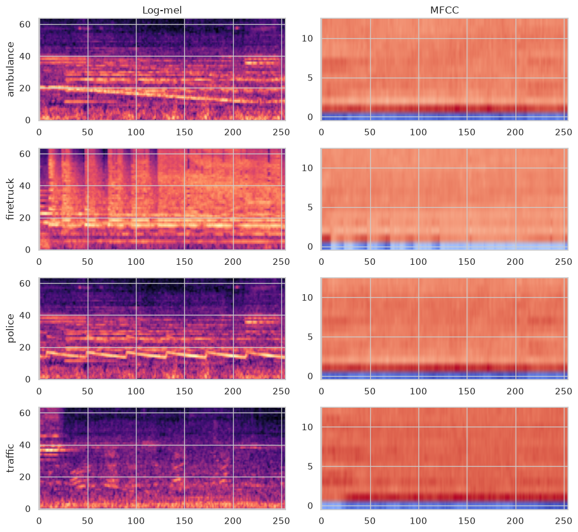

# Sistema de Reconocimiento Acústico de Vehículos de Emergencia para Vehículos Autónomos

Proyecto **Doppler**. El desarrollo experimental se realiza en Kaggle; el código y el informe viven en este repositorio.

## Resumen Ejecutivo

Este proyecto propone un sistema de reconocimiento acústico basado en aprendizaje automático (ML) para detectar y clasificar vehículos de emergencia en aproximación mediante el sonido de sus sirenas. El objetivo es que un vehículo autónomo pueda identificar patrones de sirena asociados a ambulancias, bomberos o patrullas policiales **antes** de que el emisor sea visible para las cámaras, aumentando el tiempo de reacción y mejorando la seguridad vial. En entornos urbanos congestionados, ese retraso puede afectar de forma crítica la llegada de servicios de emergencia.

La solución combina procesamiento de señales de audio y modelos supervisados. En el preprocesamiento se extraen representaciones tiempo-frecuencia (STFT, espectrograma log-mel y Coeficientes Cepstrales en la Frecuencia de Mel, MFCC). Un modelo de clasificación —con CNN sobre mapas 2D como línea base, y comparación posterior con otras arquitecturas— se entrena para dos tareas: (1) presencia de sirena frente a ruido urbano y (2) tipo etiquetado de sirena (ambulancia, policía, bomberos). La literatura reciente muestra que CNN sobre características mel es eficaz en esta familia de problemas; los sistemas de referencia más actuales (p. ej. PANNs / E2PANNs) usan sobre todo log-mel, no MFCC vectorial. MFCC+CNN se mantiene como baseline válido y reproducible, no como único enfoque de estado del arte.

La detección en tiempo real es un resultado **esperado**, no un hecho ya medido. El diseño prevé una interfaz modular (`siren_detected`, clase, confianza, marca temporal) que un controlador de vehículo o un sistema de semáforos inteligentes podría consumir. En esta fase del proyecto no se integra hardware automotriz ni se controlan semáforos reales: se define el contrato de salida y se valida el reconocimiento sobre corpora públicos.

En conjunto, Doppler propone un modelo ML especializado en sensores de audio para anticipar emergencias fuera de línea de visión. Se espera reducir colisiones, agilizar el paso de emergencias y contribuir a un tráfico más seguro. Esa expectativa se formula como **hipótesis respaldada por la literatura**, no como resultado preliminar del presente trabajo.

## Definición del Problema

### Contexto del Dominio

En entornos urbanos densamente transitados, los vehículos de emergencia (ambulancias, camiones de bomberos, patrullas policiales) deben llegar con la mayor rapidez posible. La congestión frecuente retrasa su avance, con riesgos graves de pérdida de vidas y daños materiales. Los conductores humanos reaccionan al sonido de las sirenas y a las luces; un vehículo autónomo debe emular esa capacidad auditiva. Bosch ha subrayado que, a medida que crece la conducción autónoma, los vehículos necesitan “oídos” artificiales: sensores de audio con inteligencia artificial que detecten sirenas en el entorno (Bosch Global, s.f.). La legislación en muchos países exige ceder el paso, por lo que el reconocimiento acústico no es un extra de confort, sino un requisito de cumplimiento.

Los sistemas actuales de asistencia y conducción autónoma se apoyan sobre todo en cámaras, radar y LiDAR. Esas tecnologías fallan cuando el vehículo de emergencia está fuera de línea de visión (detrás de un edificio, un camión o una curva). Un micrófono puede registrar la sirena antes de que sea visible. Investigaciones recientes muestran que sensores acústicos inteligentes identifican emergencias con esa anticipación, lo que permite ajustar trayectoria o velocidad a tiempo (Bosch Global, s.f.).

En aprendizaje automático, el problema pertenece a la **detección y clasificación de eventos sonoros** (sound event detection) en entornos ruidosos: distinguir patrones de sirena de tráfico, claxon, obras, música u otras alarmas. Las CNN han avanzado en tareas similares por su robustez al ruido y su capacidad de extraer invariantes de espectrogramas (Humphrey, Bello y LeCun, 2013; Piczak, 2015). El dominio es, por tanto, el reconocimiento acústico crítico en tiempo real dentro de transporte inteligente y conducción autónoma (Virtanen, Ellis y Plumbley, 2018).

### Descripción del Problema

El problema específico es diseñar un sistema de detección acústica en tiempo real que, dado un flujo de audio de micrófonos a bordo, (a) señale si hay sirena de emergencia y (b) asigne el tipo etiquetado (ambulancia, policía, bombero). Son dos subtareas: detección binaria sirena vs ruido, y clasificación multicategoría del patrón de sirena (Mesaros, Heittola y Virtanen, 2016).

El reto técnico es la variabilidad del audio. Las sirenas cambian de patrón (hi-lo, wail, yelp) según el país y, a veces, según el modo operativo del mismo vehículo (Zhong, Gu, Prieto y Fehler, 2025). El audio urbano es ruidoso y no estacionario; el modelo debe generalizar a grabaciones no vistas (Mittal y Chawla, 2023) y ser robusto a volumen, reverberación, Doppler y ruido de fondo.

**Limitación acústica del tipo de vehículo.** En muchos países policía, ambulancia y bomberos comparten el mismo hardware de sirena. Clasificar “tipo de vehículo” a partir del audio no equivale a identificar visualmente el vehículo: el modelo aprende el patrón acústico asociado a la *etiqueta de origen del dataset*. El solapamiento entre clases es un riesgo real y se trata como tal en los criterios de éxito y en el análisis de datos.

Las características (STFT, log-mel, MFCC) alimentan un modelo supervisado. La literatura reciente usa CNN residuales y redes preentrenadas de etiquetado de audio (PANNs) con buenos resultados; este proyecto **compara** arquitecturas en lugar de fijar una de antemano. La latencia de interés se descompone en latencia algorítmica (tamaño de la ventana de análisis, del orden de 1–2 s) y latencia de cómputo (inferencia por ventana). El umbral de 250 ms aplica a la inferencia, no a “detectar en el primer milisegundo de sirena”.

En síntesis, el problema es anticipar la presencia de vehículos de emergencia por sus sirenas y clasificar el patrón etiquetado, bajo ruido urbano y con restricciones de tiempo real, como complemento a la percepción óptica.

## Objetivos Específicos

1. **Detectar presencia de sirena** en ventanas de audio del entorno (tarea binaria sirena vs ruido urbano).
2. **Clasificar el tipo etiquetado** (ambulancia / policía / bomberos) cuando hay sirena, con la limitación acústica descrita: no se afirma identificación visual del vehículo.
3. **Preprocesar audio y extraer características**: normalización, mono, resample, STFT, log-mel, MFCC y descriptores espectrales (ZCR, centroide, bandwidth, rolloff).
4. **Comparar modelos supervisados** (CNN sobre mapas 2D, y al menos una alternativa RNN u otra CNN) y elegir el mejor *trade-off* detección/tipo. La CNN residual es una hipótesis de trabajo, no un resultado previo.
5. **Definir una interfaz modular de salida** (`event=siren_detected`, `class`, `confidence`, `timestamp`) consumible por un controlador hipotético. No forma parte del alcance de esta fase el control real de un vehículo ni de semáforos.
6. **Validar generalización en un corpus externo** (distinta fuente de grabación: p. ej. entrenar en sireNNet y evaluar detección en LSSiren o UrbanSound8K), no solo un split aleatorio del mismo conjunto.

## Criterios de Éxito

Las métricas se separan por tarea. En español de ML: **exactitud** = accuracy, **precisión** = precision (VPP), **sensibilidad / recall** = TPR, **especificidad** = TNR. La exactitud global se reporta, pero **no** es el criterio de go/no-go: un modelo que siempre predice “no hay sirena” puede tener exactitud alta en audio urbano desbalanceado y ser inútil.

1. **Detección (binaria).** Recall (sensibilidad) ≥ 0.95 en el conjunto de prueba interno, porque un falso negativo (no detectar la sirena) es el error de mayor coste. El recall **no** minimiza falsas alarmas: esas son falsos positivos. Se acota el FPR (p. ej. ≤ 0.05) y se elige el umbral maximizando **F2** (más peso al recall que a la precisión). Se reportan también PR-AUC y AUROC.
2. **Tipo (multiclase).** macro-F1 y balanced accuracy; matriz de confusión sin colapso sistemático entre pares de clases (p. ej. ambulancia vs policía). Un fallo sistemático entre tipos se documenta como limitación acústica, no se oculta con exactitud global.
3. **Latencia de inferencia.** Tiempo de cómputo por ventana &lt; 250 ms en el hardware documentado de Kaggle (CPU o GPU). La latencia algorítmica (ventana 1–2 s) se declara aparte.
4. **Robustez / generalización.** Al evaluar detección en un corpus externo ruidoso (LSSiren o clase `siren` vs no-siren de UrbanSound8K), la caída de recall debe ser ≤ 10 puntos porcentuales respecto al test interno.
5. **Interfaz y privacidad (diseño).** El módulo no ejecuta ASR ni persiste conversaciones: procesa ventanas, emite eventos y descarta el audio. El cumplimiento normativo automotriz pleno queda fuera de esta fase académica.
6. **Integración.** Se considera cumplida si la salida del modelo es un esquema estable (JSON/API) documentado, no si se enchufa a una ECU o a un semáforo real.

El cumplimiento se mide con splits internos, un corpus de prueba externo y, si en una fase posterior se graba audio propio, con ese conjunto. Los “ensayos de campo” no son un criterio de esta entrega basada en datasets públicos.

## Recolección y Comprensión de los Datos

No existe un único dataset que cubra a la vez (a) las cuatro clases del problema, (b) escala y distractores urbanos realistas y (c) grabación in-the-wild con micrófono de calle. Doppler usa un **corpus compuesto**. Kaggle es el entorno de ejecución; las fuentes no tienen por qué residir originalmente en Kaggle.

### Origen de los Datos

El inventario de fuentes se resume así. El detalle de licencias, conteos verificados y rutas está en los notebooks `01`–`03` y en las tablas de `reports/tables/`.

| Corpus | Rol en Doppler | Contenido nominal | Licencia | Fuente |
| --- | --- | --- | --- | --- |
| **sireNNet** | Primario 4 clases (detección + tipo) | 400 ambulancia, 454 policía, 400 bomberos, 421 tráfico (~1 675 WAV, ~3 s, 44.1 kHz) | CC BY 4.0 | Mendeley Data, 10.17632/j4ydzzv4kb.1 (Shah y Singh, 2023) |
| **LSSiren** | Detección binaria in-the-wild / prueba externa | 900 sirena + 900 ruido vial, 3–15 s | CC BY 4.0 | Figshare / *Scientific Data*, 10.6084/m9.figshare.19291472 (Asif et al., 2022) |
| **UrbanSound8K** | Distractores urbanos y sirena genérica | 8 732 clips, 10 clases (incl. ~929 `siren`, `car_horn`, `jackhammer`, etc.) | CC BY-NC 4.0 (uso académico) | Zenodo 10.5281/zenodo.1203745 (Salamon, Jacoby y Bello, 2014) |
| **AudioSet-EV v2** | Escala / entrenamiento posterior | ~7 900 positivos (policía, ambulancia, bomberos) + ~20 916 negativos urbanos, clips 10 s a 32 kHz | investigación / subset de AudioSet-YouTube | Zenodo 10.5281/zenodo.18668076 (Giacomelli y Rinaldi, 2025) |

**Por qué no un solo archivo de Kaggle.** El dataset popular [vishnu0399/emergency-vehicle-siren-sounds](https://www.kaggle.com/datasets/vishnu0399/emergency-vehicle-siren-sounds) tiene 600 clips de 3 s (ambulancia, bomberos, tráfico) y **no incluye policía**, así que no cubre el objetivo de tipo. ESC-50 aporta solo ~40 sirenas genéricas. FSD50K tiene etiquetas de sirena/ambulancia/policía demasiado escasas e inconsistentes para entrenar. AudioSet-EV v2 es el corpus científico más sólido del dominio (taxonomía AudioSet, distractores, splits `balanced_train`/`eval`/`unbalanced`, usado por E2PANNs), pero pesa ~8–16 GB comprimido y ~28 GB en WAV: se reserva para entrenamiento, no para la exploración inicial.

**Naturaleza de los datos.** El audio crudo es **no estructurado** (formas de onda). Tras el inventario se vuelve **semiestructurado**: cada clip se describe con ruta, corpus, etiqueta, duración, sample rate, canales y, más adelante, vectores MFCC / mapas log-mel. sireNNet y LSSiren son de clase única por archivo (single-label); AudioSet-EV admite multi-etiqueta (un clip puede ser policía+ambulancia). UrbanSound8K es single-label con *folds* oficiales y varios slices del mismo `fsID` (mismo recording), lo que obliga a no partir aleatoriamente.

**Sesgos de origen que hay que declarar desde el principio.**

- sireNNet se publicó **ya aumentado**; los autores no separan originales y aumentaciones en el zip público. Un split aleatorio puede filtrar la misma grabación a train y test.
- LSSiren mezcla cámaras de calle en Karachi, un montaje experimental con sirena estacionaria y descargas de internet; la clase positiva está sesgada a ambulancia, no a los tres tipos.
- UrbanSound8K etiqueta `siren` de forma genérica (puede incluir alarmas civiles, no solo vehículos de emergencia) y es CC BY-NC.
- AudioSet-EV proviene de YouTube: gran diversidad geográfica, pero etiquetas ruidosas y posible desaparición de vídeos; además, policía/ambulancia/bomberos pueden compartir patrón acústico.

### Proceso de Adquisición

El flujo es reproducible y el mismo en local y en Kaggle:

1. Descargar corpora de trabajo con `python scripts/download_corpora.py` (o adjuntar los WAV ya subidos como datasets de Kaggle). AudioSet-EV v2 no se descarga en esta fase.
2. Dejar cada corpus en `data/raw/{sirennet,lssiren,urbansound8k}` en local, o bajo `/kaggle/input/<slug>/` en Kaggle. `src/paths.py` resuelve ambos.
3. Inventariar archivos (`src/inventory.py`): etiqueta, tarea, ruta. UrbanSound8K usa el CSV oficial (`fold`, `fsID`, `class`).
4. No mezclar corpora en un único split de entrenamiento sin declarar el origen. El protocolo previsto es: **entrenar tipo y detección en sireNNet**; **probar detección en LSSiren**; usar UrbanSound8K como distractores / sirena genérica con los 10 folds oficiales (nunca mezclar slices del mismo `fsID` entre train y test).
5. Normalización posterior (no se altera el WAV crudo en esta fase): mono, resample a 22 050 Hz para características, ventanas de análisis fijas. El EDA mide primero sample rate y duración *nativos*.

Instrucciones de montaje: [data/README.md](data/README.md). Notebooks: [notebooks/README.md](notebooks/README.md).

### Exploración de los Datos

La exploración se ejecuta en [`notebooks/02_exploracion.ipynb`](notebooks/02_exploracion.ipynb). En esta fase se montó **sireNNet completo** (1 675 WAV), las **tablas de características de LSSiren** (sin WAV; los zip de ~2.3 GB están disponibles con el script de descarga) y el **CSV oficial de UrbanSound8K**. Conteos verificados:

| Corpus | Clase | n | Notas |
| --- | --- | ---: | --- |
| sireNNet | ambulance | 400 | WAV, 44.1 kHz, estéreo, ~3.00 s |
| sireNNet | firetruck | 400 | igual |
| sireNNet | police | 454 | clase más numerosa |
| sireNNet | traffic | 421 | negativa para detección |
| LSSiren (CSV) | siren | 932 | paper reporta 900; el CSV público trae 932 filas |
| LSSiren (CSV) | road_noise | 902 | paper reporta 900 |
| UrbanSound8K | siren | 929 slices / **74 recordings** | ~12.6 slices por grabación |
| UrbanSound8K | car_horn | 429 / 125 rec. | distractor duro |
| UrbanSound8K | jackhammer, drilling, engine_idling, … | 1 000 c/u | distractores urbanos |
| UrbanSound8K | gun_shot | 374 / 117 rec. | minoritaria |

**Homogeneidad de sireNNet.** Los 1 675 WAV tienen sample rate **44 100 Hz**, **2 canales** y duración **3.000–3.019 s** (casi un delta en 3.000 s). Eso es típico de un corpus recortado, normalizado y aumentado: excelente para tensores fijos de CNN, peligroso si se interpreta como diversidad acústica real.





**UrbanSound8K y fuga de información.** La clase `siren` no es 929 grabaciones independientes: son 929 *slices* de 74 fuentes (`fsID`). `jackhammer` es aún más extremo (1 000 slices / 45 recordings). Un `train_test_split` aleatorio por archivo filtraría el mismo evento a ambos lados. El protocolo correcto es respetar los 10 folds oficiales y, en cualquier corpus, agrupar por grabación.



**Tiempo-frecuencia.** Un ejemplo por clase de sireNNet (ventana de 3 s, STFT hasta 8 kHz) muestra estructura tonal periódica en las sirenas y ruido de banda ancha en tráfico: ambulancia con bandas sostenidas ~1–2 kHz, policía con barridos rápidos tipo yelp, bomberos con pulsos de alta energía, tráfico sin patrón melódico repetido.



### Análisis de Variables Relevantes

Variables de inventario: `corpus`, `label`, `task`, `duration_s`, `sr`, `n_channels`. Variables de señal extraídas en [`notebooks/03_variables_relevantes.ipynb`](notebooks/03_variables_relevantes.ipynb) sobre una muestra estratificada de **40 clips por clase** de sireNNet (SEED=7): ZCR, centroide espectral, bandwidth, rolloff y 13 MFCC.

Medias de descriptores (muestra):

| Clase | ZCR | Centroide (Hz) | Bandwidth (Hz) | Rolloff (Hz) |
| --- | ---: | ---: | ---: | ---: |
| ambulance | 0.119 | 1 962 | 1 881 | 3 309 |
| firetruck | 0.144 | 2 457 | 2 246 | 4 616 |
| police | 0.097 | 1 774 | 1 764 | 3 055 |
| traffic | 0.077 | 1 670 | 2 000 | 3 278 |

Lectura operativa:

- **Sirena vs tráfico.** El tráfico tiene menor ZCR medio (0.077 vs 0.12 en sirenas agregadas) y **mucha más dispersión** de centroide (std 669 Hz vs 290–408 Hz en tipos de sirena): el negativo es heterogéneo; las sirenas son más tonales y estables.
- **Tipo.** Bomberos se separan hacia frecuencias más altas (centroide 2 457 Hz, rolloff 4 616 Hz). Ambulancia y policía se solapan en centroide/rolloff; el STFT sugiere que la diferencia está más en la *modulación temporal* (wail vs yelp) que en un timbre estático.
- **MFCC.** Los coeficientes 1–3 concentran la separación; a partir del 4 las curvas de los tres tipos de sirena convergen. El tráfico se aparta sobre todo en MFCC-2 y MFCC-3. Promediar MFCC en el tiempo **borra** el yelp/wail, que sí permanece en el mapa log-mel.







**Decisión de representación para el modelo.** CNN sobre **log-mel 2D** como entrada principal (conserva tiempo y frecuencia). MFCC 13–20 como baseline compacto (SVM / MLP / CNN 1D) comparable con papers clásicos. No se usará solo el vector MFCC promediado para clasificar tipo.

### Hallazgos Iniciales

1. **El corpus primario está “demasiado limpio”.** sireNNet es 4 clases casi balanceadas, 3 s fijos, 44.1 kHz estéreo y un release **ya aumentado**. Una exactitud del 98 % en un split aleatorio de sireNNet no demuestra detección en calle. La validación tiene que ser agrupada y, para detección, **externa** (LSSiren WAV o UrbanSound8K `siren` vs no-siren).
2. **Detectar es más fácil que tipificar.** El STFT y los descriptores separan sirena de tráfico con claridad relativa. Ambulancia vs policía se solapan en MFCC promedio y en centroide; el tipo depende de la dinámica temporal. Eso confirma la limitación acústica declarada en los objetivos: el modelo aprende el patrón etiquetado, no el vehículo visto.
3. **Bomberos es la clase más “brillante”** en esta muestra (ZCR, centroide y rolloff más altos). Conviene vigilar si eso es el patrón de sirena o un sesgo de grabación/aumento.
4. **UrbanSound8K no es un set de tipo**, pero es el mejor banco de **falsos positivos** (claxon, jackhammer, idle). Hay que usar folds y `fsID`, no shuffle de slices. 929 sirenas genéricas no equivalen a 929 emergencias distintas.
5. **LSSiren CSV vs WAV.** Las tablas Figshare (`Ambulance_final.csv`, `Road_final.csv`) ya traen 21 MFCC + descriptores y ~1 834 filas (ligeramente por encima de los 1 800 del paper). Sirven para EDA tabular y para un baseline. El audio in-the-wild (Karachi) sigue siendo necesario para espectrogramas de calle y para el test externo de recall: se descarga con `python scripts/download_corpora.py --corpus lssiren` (sin `--lssiren-csv-only`).
6. **AudioSet-EV v2 sigue siendo el salto de escala.** Cuando el pipeline de log-mel esté cerrado, ese corpus (~7 900 positivos con taxonomía policía/ambulancia/bomberos y ~20 916 negativos urbanos) es el candidato de entrenamiento a gran escala. No se descarga en esta fase por tamaño (~28 GB WAV).
7. **Implicación para splits.** Entrenar tipo en sireNNet con validación que no mezcle aumentaciones evidentes (p. ej. `sound_76.wav` y `sound_76_1.wav` en la muestra de ambulancia). Evaluar detección en LSSiren y/o UrbanSound8K. No mezclar los tres en un único pool sin una columna `corpus`.

Estos hallazgos cierran la comprensión de datos y fijan el protocolo de modelado; no se entrena el clasificador en esta entrega.

## Estructura del repositorio

```
doppler-ml/
  notebooks/          # 01 origen, 02 exploración, 03 características
  src/                # paths, inventario, características de audio
  data/raw/           # WAV (gitignored); ver data/README.md
  reports/figures/    # figuras del EDA para este documento
  reports/tables/     # CSV de inventario y resúmenes
  scripts/            # descarga de corpora
```
