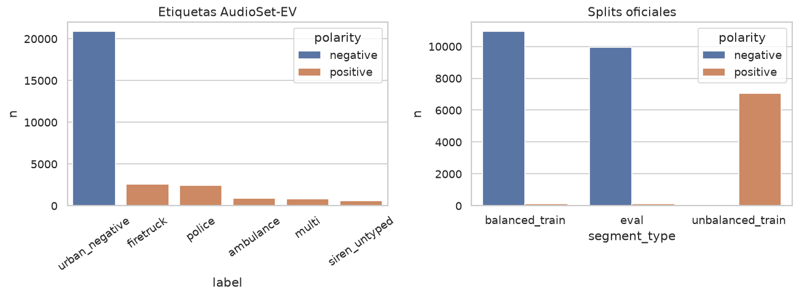

# Sistema de Reconocimiento Acústico de Vehículos de Emergencia para Vehículos Autónomos

## Resumen Ejecutivo

Este proyecto propone un sistema de reconocimiento acústico basado en aprendizaje automático (ML) para detectar y clasificar vehículos de emergencia en aproximación mediante el sonido de sus sirenas. El objetivo es que un vehículo autónomo pueda identificar patrones de sirena asociados a ambulancias, bomberos o patrullas policiales **antes** de que el emisor sea visible para las cámaras, aumentando el tiempo de reacción y mejorando la seguridad vial. En entornos urbanos congestionados, ese retraso puede afectar de forma crítica la llegada de servicios de emergencia.

La solución combina procesamiento de señales de audio y modelos supervisados. En el preprocesamiento se extraen representaciones tiempo-frecuencia (STFT, espectrograma log-mel y Coeficientes Cepstrales en la Frecuencia de Mel, MFCC). Un modelo de clasificación —con CNN sobre mapas 2D como línea base, y comparación posterior con otras arquitecturas— se entrena para dos tareas: (1) presencia de sirena frente a ruido urbano y (2) tipo etiquetado de sirena (ambulancia, policía, bomberos). La literatura reciente muestra que CNN sobre características mel es eficaz en esta familia de problemas; los sistemas de referencia más actuales (p. ej. PANNs / E2PANNs) usan sobre todo log-mel, no MFCC vectorial. MFCC+CNN se mantiene como baseline válido y reproducible, no como único enfoque de estado del arte.

La detección en tiempo real es un resultado **esperado**, no un hecho ya medido. El diseño prevé una interfaz modular (`siren_detected`, clase, confianza, marca temporal) que un controlador de vehículo o un sistema de semáforos inteligentes podría consumir. En esta fase del proyecto no se integra hardware automotriz ni se controlan semáforos reales: se define el contrato de salida y se valida el reconocimiento sobre corpora públicos.

En conjunto, Doppler propone un modelo ML especializado en sensores de audio para anticipar emergencias fuera de línea de visión. Se espera reducir colisiones, agilizar el paso de emergencias y contribuir a un tráfico más seguro. Esa expectativa se formula como **hipótesis respaldada por la literatura**, no como resultado preliminar del presente trabajo.

## Definición del Problema

### Contexto del Dominio

En entornos urbanos densamente transitados, los vehículos de emergencia (ambulancias, camiones de bomberos, patrullas policiales) deben llegar con la mayor rapidez posible. La congestión frecuente retrasa su avance, con riesgos graves de pérdida de vidas y daños materiales. Los conductores humanos reaccionan al sonido de las sirenas y a las luces; un vehículo autónomo debe emular esa capacidad auditiva. Bosch ha subrayado que, a medida que crece la conducción autónoma, los vehículos necesitan “oídos” artificiales: sensores de audio con inteligencia artificial que detecten sirenas en el entorno (Bosch Global, s.f.). La legislación en muchos países exige ceder el paso, por lo que el reconocimiento acústico no es un extra de confort, sino un requisito de cumplimiento.

Los sistemas actuales de asistencia y conducción autónoma se apoyan sobre todo en cámaras, radar y LiDAR. Esas tecnologías fallan cuando el vehículo de emergencia está fuera de línea de visión (detrás de un edificio, un camión o una curva). Un micrófono puede registrar la sirena antes de que sea visible. Investigaciones recientes muestran que sensores acústicos inteligentes identifican emergencias con esa anticipación, lo que permite ajustar trayectoria o velocidad a tiempo (Bosch Global, s.f.).

En aprendizaje automático, el problema pertenece a la **detección y clasificación de eventos sonoros** (sound event detection) en entornos ruidosos: distinguir patrones de sirena de tráfico, claxon, obras, música u otras alarmas. Las CNN han avanzado en tareas similares por su robustez al ruido y su capacidad de extraer invariantes de espectrogramas (Humphrey, Bello y LeCun, 2013; Piczak, 2015). El dominio es, por tanto, el reconocimiento acústico crítico en tiempo real dentro de transporte inteligente y conducción autónoma (Virtanen, Ellis y Plumbley, 2018).

### Descripción del Problema

El problema específico es diseñar un sistema de detección acústica en tiempo real que, dado un flujo de audio de micrófonos a bordo, (a) señale si hay sirena de emergencia y (b) asigne el tipo etiquetado (ambulancia, policía, bombero). Son dos subtareas: detección binaria sirena vs ruido, y clasificación multicategoría del patrón de sirena (Mesaros, Heittola y Virtanen, 2016).

El reto técnico es la variabilidad del audio. Las sirenas cambian de patrón (hi-lo, wail, yelp) según el país y, a veces, según el modo operativo del mismo vehículo (Zhong, Gu, Prieto y Fehler, 2025). El audio urbano es ruidoso y no estacionario; el modelo debe generalizar a grabaciones no vistas (Mittal y Chawla, 2023) y ser robusto a volumen, reverberación, Doppler y ruido de fondo.

**Limitación acústica del tipo de vehículo.** En muchos países policía, ambulancia y bomberos comparten el mismo hardware de sirena. Clasificar “tipo de vehículo” a partir del audio no equivale a identificar visualmente el vehículo: el modelo aprende el patrón acústico asociado a la _etiqueta de origen del dataset_. El solapamiento entre clases es un riesgo real y se trata como tal en los criterios de éxito y en el análisis de datos.

Las características (STFT, log-mel, MFCC) alimentan un modelo supervisado. La literatura reciente usa CNN residuales y redes preentrenadas de etiquetado de audio (PANNs) con buenos resultados; este proyecto **compara** arquitecturas en lugar de fijar una de antemano. La latencia de interés se descompone en latencia algorítmica (tamaño de la ventana de análisis, del orden de 1–2 s) y latencia de cómputo (inferencia por ventana). El umbral de 250 ms aplica a la inferencia, no a “detectar en el primer milisegundo de sirena”.

En síntesis, el problema es anticipar la presencia de vehículos de emergencia por sus sirenas y clasificar el patrón etiquetado, bajo ruido urbano y con restricciones de tiempo real, como complemento a la percepción óptica.

## Objetivos Específicos

1. **Detectar presencia de sirena** en ventanas de audio del entorno (tarea binaria sirena vs ruido urbano).
2. **Clasificar el tipo etiquetado** (ambulancia / policía / bomberos) cuando hay sirena, con la limitación acústica descrita: no se afirma identificación visual del vehículo.
3. **Preprocesar audio y extraer características**: normalización, mono, resample, STFT, log-mel, MFCC y descriptores espectrales (ZCR, centroide, bandwidth, rolloff).
4. **Comparar modelos supervisados** (CNN sobre mapas 2D, y al menos una alternativa RNN u otra CNN) y elegir el mejor _trade-off_ detección/tipo. La CNN residual es una hipótesis de trabajo, no un resultado previo.
5. **Definir una interfaz modular de salida** (`event=siren_detected`, `class`, `confidence`, `timestamp`) consumible por un controlador hipotético. No forma parte del alcance de esta fase el control real de un vehículo ni de semáforos.
6. **Validar generalización en un corpus externo** (distinta fuente de grabación: p. ej. entrenar en sireNNet y evaluar detección en LSSiren o UrbanSound8K), no solo un split aleatorio del mismo conjunto.

## Criterios de Éxito

Las métricas se separan por tarea. En español de ML: **exactitud** = accuracy, **precisión** = precision (VPP), **sensibilidad / recall** = TPR, **especificidad** = TNR. La exactitud global se reporta, pero **no** es el criterio de go/no-go: un modelo que siempre predice “no hay sirena” puede tener exactitud alta en audio urbano desbalanceado y ser inútil.

1. **Detección (binaria).** Recall (sensibilidad) ≥ 0.95 en el conjunto de prueba interno, porque un falso negativo (no detectar la sirena) es el error de mayor coste. El recall **no** minimiza falsas alarmas: esas son falsos positivos. Se acota el FPR (p. ej. ≤ 0.05) y se elige el umbral maximizando **F2** (más peso al recall que a la precisión). Se reportan también PR-AUC y AUROC.
2. **Tipo (multiclase).** macro-F1 y balanced accuracy; matriz de confusión sin colapso sistemático entre pares de clases (p. ej. ambulancia vs policía). Un fallo sistemático entre tipos se documenta como limitación acústica, no se oculta con exactitud global.
3. **Latencia de inferencia.** Tiempo de cómputo por ventana &lt; 250 ms en el hardware documentado de Kaggle (CPU o GPU). La latencia algorítmica (ventana 1–2 s) se declara aparte.
4. **Robustez / generalización.** Al evaluar detección en un corpus externo ruidoso (LSSiren o clase `siren` vs no-siren de UrbanSound8K), la caída de recall debe ser ≤ 10 puntos porcentuales respecto al test interno.
5. **Interfaz y privacidad (diseño).** El módulo no ejecuta ASR ni persiste conversaciones: procesa ventanas, emite eventos y descarta el audio. El cumplimiento normativo automotriz pleno queda fuera de esta fase académica.
6. **Integración.** Se considera cumplida si la salida del modelo es un esquema estable (JSON/API) documentado, no si se enchufa a una ECU o a un semáforo real.

El cumplimiento se mide con splits internos, un corpus de prueba externo y, si en una fase posterior se graba audio propio, con ese conjunto. Los “ensayos de campo” no son un criterio de esta entrega basada en datasets públicos.

## Recolección y Comprensión de los Datos

No existe un único dataset que cubra a la vez (a) las cuatro clases del problema, (b) escala y distractores urbanos realistas y (c) grabación in-the-wild con micrófono de calle. Doppler usa un **corpus compuesto**, con roles distintos: **AudioSet-EV v2 es el único train**; sireNNet es el piloto ya explorado (test limpio opcional); LSSiren y UrbanSound8K son tests de otro dominio, más adelante. Kaggle es el entorno de ejecución.

### Origen de los Datos

El inventario de fuentes se resume así. El detalle está en los notebooks `01`–`04` y en `reports/tables/`.

| Corpus             | Rol en Doppler                         | Contenido nominal                                                                                 | Licencia                                   | Fuente                                                                         |
| ------------------ | -------------------------------------- | ------------------------------------------------------------------------------------------------- | ------------------------------------------ | ------------------------------------------------------------------------------ |
| **AudioSet-EV v2** | Train (detección + tipo)               | ~7 900 positivos (policía, ambulancia, bomberos; parte multi-etiqueta) + ~20 916 negativos urbanos, ~10 s a 32 kHz mono | investigación / subset de AudioSet-YouTube | Zenodo 10.5281/zenodo.18668076 (Giacomelli y Rinaldi, 2025)                    |
| **sireNNet**       | Piloto / test limpio opcional          | 400 ambulancia, 454 policía, 400 bomberos, 421 tráfico (~1 675 WAV, ~3 s, 44.1 kHz)               | CC BY 4.0                                  | Mendeley Data, 10.17632/j4ydzzv4kb.1 (Shah y Singh, 2023)                      |
| **LSSiren**        | Test de dominio (calle), no train      | 900 sirena + 900 ruido vial, 3–15 s                                                               | CC BY 4.0                                  | Figshare / _Scientific Data_, 10.6084/m9.figshare.19291472 (Asif et al., 2022) |
| **UrbanSound8K**   | Test de distractores nombrados         | 8 732 clips, 10 clases (incl. ~929 `siren`, `car_horn`, `jackhammer`, etc.)                       | CC BY-NC 4.0 (uso académico)               | Zenodo 10.5281/zenodo.1203745 (Salamon, Jacoby y Bello, 2014)                  |

**Por qué no un solo archivo de Kaggle.** El dataset popular [vishnu0399/emergency-vehicle-siren-sounds](https://www.kaggle.com/datasets/vishnu0399/emergency-vehicle-siren-sounds) tiene 600 clips de 3 s y **no incluye policía**. ESC-50 aporta ~40 sirenas genéricas. FSD50K es demasiado escaso e inconsistente. AudioSet-EV v2 es el corpus científico de referencia del dominio (taxonomía AudioSet, distractores, splits `balanced_train`/`eval`/`unbalanced`, usado por E2PANNs). El zip pesa ~16 GB; los WAV extraídos ocupan del orden de 18–28 GB.

**Naturaleza de los datos.** El audio crudo es **no estructurado**. Tras el inventario es **semiestructurado**: ruta, corpus, etiqueta, `yt_id`, split oficial, polaridad, y más adelante MFCC / log-mel. sireNNet y LSSiren son single-label; AudioSet-EV admite **multi-etiqueta**. UrbanSound8K es single-label con folds y varios slices del mismo `fsID`.

**Sesgos de origen.**

- AudioSet-EV es YouTube: diversidad geográfica, etiquetas ruidosas, vídeos que desaparecen, y policía/ambulancia/bomberos que pueden compartir patrón acústico. El CSV de negativos lista ~640 k candidatos de AudioSet; solo ~20 916 tienen WAV (`downloaded=True`).
- sireNNet se publicó **ya aumentado**; un split aleatorio puede filtrar la misma grabación a train y test. No se usa para `fit`.
- LSSiren mezcla calle en Karachi, montaje experimental e internet; la positiva está sesgada a ambulancia.
- UrbanSound8K etiqueta `siren` de forma genérica y es CC BY-NC.

### Proceso de Adquisición

1. Descargar AudioSet-EV con `python scripts/download_corpora.py --corpus audioset_ev` (o montar el dataset en Kaggle). Si el ZIP de Zenodo no está, los CSV de metadatos (`EV_Positives.csv`, `EV_Negatives.csv`) bastan para el índice y los splits; los WAV se extraen después.
2. Dejar cada corpus en `data/raw/{audioset_ev,sirennet,lssiren,urbansound8k}` o bajo `/kaggle/input/<slug>/`.
3. Inventariar (`src/inventory.py`): filtrar `downloaded=True`, mapear MID → `police` / `ambulance` / `firetruck`, marcar `multi` y `siren_untyped` (solo etiqueta padre `/m/03j1ly` o sirena genérica `/m/03kmc9`).
4. **No mezclar** AudioSet-EV con sireNNet en un único pool. Protocolo: train en AudioSet-EV (splits oficiales); test interno = `eval`; LSSiren y UrbanSound8K = otro dominio más adelante.
5. No se altera el WAV crudo. El preproceso (mono, 22 050 Hz, 10 s, log-mel) vive en la notebook 04.

Instrucciones: [data/README.md](data/README.md). Notebooks: [notebooks/README.md](notebooks/README.md).

### Exploración de los Datos

La exploración de **train** está en [`notebooks/02_exploracion.ipynb`](notebooks/02_exploracion.ipynb). Conteos verificados sobre metadatos `downloaded=True` (SEED=7). Esta entrega tiene el **índice CSV completo**; el ZIP de WAV (~16 GB) se descarga aparte y aún no estaba extraído al cerrar las figuras tiempo-frecuencia de AudioSet.

| Corpus       | Clase            |       n | Notas                                      |
| ------------ | ---------------- | ------: | ------------------------------------------ |
| AudioSet-EV  | urban_negative   |  20 916 | WAV de `balanced_train` + `eval`           |
| AudioSet-EV  | firetruck        |   2 562 | single-label puro                          |
| AudioSet-EV  | police           |   2 427 | single-label puro                          |
| AudioSet-EV  | ambulance        |     934 | clase positiva más escasa                  |
| AudioSet-EV  | multi            |     829 | ≥2 tipos EV; no se aplana a una clase      |
| AudioSet-EV  | siren_untyped    |     572 | positivo sin tipo fino                     |
| sireNNet     | 4 clases         |   1 675 | piloto; 44.1 kHz estéreo, ~3.00 s          |
| LSSiren CSV  | siren / road     | 932 / 902 | sin WAV en esta fase                    |
| UrbanSound8K | siren            | 929 / 74 rec. | folds oficiales; no es set de tipo    |

**Splits oficiales (no son un 70/15/15).** Los positivos de tipo están casi todos en `unbalanced_train` (7 073). `balanced_train` positivo son **124** filas: no sirven de train de tipo. Los negativos no traen `unbalanced` a propósito: 10 963 en `balanced_train` y 9 953 en `eval`.



**Piloto sireNNet.** Los 1 675 WAV siguen siendo 44 100 Hz, 2 canales, ~3.00 s. Sirvieron para fijar la hipótesis de representación (log-mel 2D, no solo MFCC promediado) y no se mezclan con YouTube.


**UrbanSound8K y fuga.** `siren` son 929 slices de 74 `fsID`. El protocolo futuro respeta folds oficiales.

### Análisis de Variables Relevantes

En [`notebooks/03_variables_relevantes.ipynb`](notebooks/03_variables_relevantes.ipynb) el extractor (13 MFCC mean/std, ZCR, centroide, bandwidth, rolloff, log-mel 64×T, 10 s, 22 050 Hz) está listo sobre AudioSet-EV. Sin WAV extraídos no se recalculan las medias de descriptores de YouTube en esta máquina; se **revalida** la decisión del piloto sireNNet (muestra de 40 clips/clase, SEED=7):

| Clase (piloto) |   ZCR | Centroide (Hz) | Bandwidth (Hz) | Rolloff (Hz) |
| -------------- | ----: | -------------: | -------------: | -----------: |
| ambulance      | 0.119 |          1 962 |          1 881 |        3 309 |
| firetruck      | 0.144 |          2 457 |          2 246 |        4 616 |
| police         | 0.097 |          1 774 |          1 764 |        3 055 |
| traffic        | 0.077 |          1 670 |          2 000 |        3 278 |

**Decisión de representación.** CNN sobre **log-mel 2D** (`n_mels=64`, `n_fft=1024`, `hop=256`). MFCC 13–20 como baseline. No se clasifica tipo con el vector MFCC promediado. Los clips `multi` van a cabeza multi-etiqueta o se excluyen de la tarea de tipo (`type_eligible`).


### Hallazgos Iniciales

1. **El train es AudioSet-EV, no sireNNet.** sireNNet está “demasiado limpio”; un 98 % ahí no es calle. Queda como piloto y test limpio opcional.
2. **`balanced_train` positivo no es el train de tipo.** Hay 124 positivos frente a 7 073 en `unbalanced_train`.
3. **El `eval` oficial es un test de detección muy negativo:** 127 sirenas vs 9 953 urbanos. La métrica de go/no-go sigue siendo recall + FPR/F2, no exactitud.
4. **Detectar es más fácil que tipificar** (piloto y literatura). 829 multi-label y 572 `siren_untyped` lo confirman: no se fuerza un argmax.
5. **Ambulancia es la clase pura más pequeña** (934). Conviene vigilar recall por clase.
6. **LSSiren y UrbanSound8K no entran al `fit`.** Miden otro dominio cuando haya WAV.
7. **WAV crudos de AudioSet-EV.** El índice y los splits ya están cerrados sobre metadatos. Extraer el ZIP de Zenodo (`scripts/download_corpora.py --corpus audioset_ev`) habilita el probe de 10 s / 32 kHz y el scaler tabular.

Estos hallazgos cierran la comprensión de datos. La preparación (índice, splits, contrato de preproceso) está en la sección siguiente; no se entrena el clasificador aquí.

## Preparación de los Datos

Código: [`notebooks/04_preparacion.ipynb`](notebooks/04_preparacion.ipynb). El enunciado lista 4.5 al final; **el scaler no puede verse el test**, así que la notebook ejecuta limpieza → división → fit del escalador.

### 4.1. Limpieza de Datos

No se reescribe el WAV crudo ni se aplica denoise (destruiría armónicos de sirena). Se construye un índice (`audioset_ev_clean_index.csv`) con `yt_id` como `group_id`, polaridad, etiquetas EV, flags y `keep`.

Verificado en esta corrida (metadatos `downloaded=True`, 28 240 filas):

| n     | keep  | missing_wav | unreadable | clipping | short | multi_positive |
| ----: | ----: | ----------: | ---------: | -------: | ----: | -------------: |
| 28240 | 28240 |       28240 |          0 |        0 |     0 |            829 |

`missing_wav = 28 240` significa que **el índice está completo y los WAV aún no estaban en disco** al ejecutar. Cuando el ZIP se extraiga, el mismo código marca ilegibles, duración &lt; 1 s y clipping (pico ≥ 0.999) solo sobre archivos presentes. `type_eligible` = positivo, no `multi`, etiqueta en {ambulance, police, firetruck}.

### 4.2. Normalización y Escalamiento

Por clip, sin estadística global: peak-norm (y RMS opcional) al cargar. Resample a **22 050 Hz**. `StandardScaler` del vector tabular (MFCC mean/std + descriptores) se ajusta **solo** en filas `split==train` de la muestra con audio. Sin WAV de train en esta máquina el scaler no se fitea (evitaría filtrar val/test). AudioSet-EV ya es mono 32 kHz; sireNNet (piloto) era estéreo 44.1 kHz.

### 4.3. Transformaciones

Pad/trim a **10.0 s** (nativo AudioSet-EV; no se fuerza el 3 s del piloto). STFT ilustrativo; entrada CNN = log-mel `n_mels=64`, `n_fft=1024`, `hop=256`. Nada de max-pooling global ni estadísticas del dataset entero sobre el mapa 2D.

### 4.4. Ingeniería de Características

13 MFCC (media y desviación temporal) + ZCR, centroide, bandwidth, rolloff. El extractor está en la notebook 04; no se versionan ~28 k tensores. Tipo: no usar solo MFCC promediado; `multi` no se aplana.

### 4.5. División del Conjunto de Datos

No hay `train_test_split` aleatorio ni un pool único de los cuatro corpora. `GroupShuffleSplit` por `yt_id` solo recorta **val (15 %, SEED=7)** del train pool. Intersección de `yt_id`: train∩val = train∩test = val∩test = **0**.

| Split                 | Origen                                                          | siren | urban_negative |
| --------------------- | --------------------------------------------------------------- | ----: | -------------: |
| **train**             | positivos `unbalanced_train` + negativos `balanced_train`       |  6010 |           9320 |
| **val**               | 15 % de grupos `yt_id` del train pool                           |  1063 |           1643 |
| **test**              | `eval` oficial                                                  |   127 |           9953 |
| **balanced_train_ref**| positivos `balanced_train` (referencia; no sustituye unbalance) |   124 |              0 |


Tabla persistida: `reports/tables/audioset_ev_splits.csv`. Protocolo de otro dominio (sin WAV aún): LSSiren = `external_test_detection` (corpus entero); UrbanSound8K = folds + `fsID`; sireNNet = eval limpio opcional.

## Estructura del repositorio

```
doppler-ml/
  notebooks/          # 01 origen, 02 exploración, 03 características, 04 preparación
  src/                # paths, inventario, características de audio
  data/raw/           # WAV y CSV (gitignored); ver data/README.md
  reports/figures/    # figuras del EDA y de splits
  reports/tables/     # CSV de inventario, limpieza y splits
  scripts/            # descarga de corpora y generación de notebooks
```

